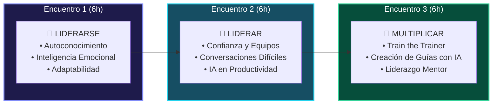

# 🌟 LÍDERES FORMANDO LÍDERES
### *Programa de desarrollo, liderazgo y multiplicación de capacidades*

> [!abstract] Resumen Ejecutivo
> Un programa presencial intensivo de **18 horas** dividido en **3 encuentros vivenciales de 6 horas**, diseñado bajo los modelos internacionales de *Leadership Development*, *Leaders Developing Leaders* y *Train the Trainer*. Integra de forma transversal herramientas de **Inteligencia Artificial y productividad digital** aplicadas a la gestión y transferencia de conocimiento.

---

## 💰 01. Inversión Comercial y Condiciones

| Concepto | Alcance | Inversión (COP) |
| :--- | :--- | :--- |
| **Programa Base Líderes Formando Líderes** | 18 Horas · 2 Facilitadores · Hasta 15 personas · Certificación | **$12.000.000 + IVA** |
| *(Opcional)* **Producción Audiovisual Profesional** | Registro audiovisual profesional de la experiencia y video de memoria corporativa | **$4.000.000 + IVA** |

> [!info] Condiciones Comerciales & Hitos de Pago
> - **Forma de Pago:** 50% de anticipo (reserva y formalización) / 50% al finalizar el tercer encuentro.
> - **Vigencia:** 30 días calendario.
> - **Ajuste por aforo:** Para grupos mayores a 15 personas se ajustará de común acuerdo.

### 📋 Alcance: Qué Incluye vs. Logística del Cliente

> [!check] **Incluido en el Programa**
> - ✅ **18 horas presenciales** (3 jornadas vivenciales de 6h).
> - ✅ **2 Facilitadores expertos en vivo** durante todas las sesiones.
> - ✅ **Diseño metodológico y materiales** de trabajo exclusivos.
> - ✅ **Integración transversal de Inteligencia Artificial aplicada**.
> - ✅ **Constancia de Participación** física y digital emitida por *PD'P Academia / Grupo Ve Por Más S.A.S.*
> - ✅ **Seguimiento y memorias** de las jornadas.

> [!warning] **A cargo del Cliente / No Incluye**
> - ❌ Espacio físico/auditorio con ayudas audiovisuales.
> - ❌ Alimentación, catering o refrigerios.
> - ❌ Viáticos fuera del área metropolitana acordada.
> - ❌ Licencias o suscripciones a software de terceros.

---

## 🧭 02. Ruta y Pipeline Metodológico

---

## 📌 03. Desglose de Encuentros

### 🔹 Encuentro 1: `LIDERARSE`
> *"El líder comienza por sí mismo para ejercer un liderazgo consciente, cercano y efectivo."*

- **Enfoque:** Reconocimiento personal, mentalidad y gestión del cambio.
- **Ejes temáticos:**
  - 🔍 **Autoconocimiento:** Identificación de fortalezas y brechas de mejora.
  - 🗣️ **Comunicación consciente:** Expresión clara y asertividad.
  - 🧘 **Gestión emocional:** Manejo de la presión, empatía y relaciones interpersonales.
  - 🔄 **Adaptabilidad:** Resiliencia y navegación en entornos de incertidumbre.
- **Dinámica Vivencial:** Espacio de introspección guiada para mapear el estilo de liderazgo actual y definir acuerdos de transformación personal.

---

### 🔹 Encuentro 2: `LIDERAR`
> *"El liderazgo se demuestra en la relación, la movilización y la confianza con otros."*

- **Enfoque:** Dinámica de equipos, feedback y herramientas digitales de alto impacto.
- **Ejes temáticos:**
  - 🤝 **Construcción de confianza:** Cultura de seguridad psicológica y colaboración.
  - 🎯 **Comunicación orientada a resultados:** Alineación de metas y compromisos.
  - ⚡ **Conversaciones de liderazgo:** Feedback constructivo y gestión de desacuerdos.
  - 🤖 **Inteligencia Artificial Práctica:** Uso de herramientas de IA generativa para optimización de tareas, síntesis de reuniones y organización diaria.
- **Dinámica Vivencial:** Simulación de escenarios reales de toma de decisiones e interacción con asistentes de IA aplicados a la gestión.

---

### 🔹 Encuentro 3: `MULTIPLICAR`
> *"Un líder transforma cuando logra que otros también crezcan y repliquen capacidades."*

- **Enfoque:** Pedagogía ágil, facilitación y mentoría interna (*Train the Trainer*).
- **Ejes temáticos:**
  - 📚 **Transferencia estructurada:** Cómo empaquetar aprendizajes en herramientas claras.
  - 🎙️ **Facilitación y oratoria:** Técnicas para dinamizar espacios de aprendizaje.
  - 🛠️ **IA Multiplicadora:** Creación rápida de guías, presentaciones y recursos de apoyo con IA.
  - 🧭 **Visión de Líder Mentor:** Plan de acción individual para multiplicar conocimientos en el equipo.
- **Dinámica Vivencial:** Los participantes diseñan y facilitan una mini-sesión de transferencia práctica de conocimiento.

---

## 👥 04. Facilitadores Principales y Respaldo Institucional

| Facilitador | Perfil & Especialidad |
| :--- | :--- |
| **Juan Manuel** | Consultor, formador y estratega en marketing, comunicación estratégica, transformación digital e **Inteligencia Artificial aplicada**. |
| **Eduardo** | Facilitador y especialista con amplia trayectoria en procesos vivenciales de **liderazgo, habilidades humanas y desarrollo organizacional**. |

### 🏛️ Experiencia Institucional & Clientes Corporativos
*Cámara de Comercio · Leonisa · Fenalco Antioquia · Universidad de Medellín · Alcaldía de Itagüí · Finanzas Consulting · Matuna.*

### 🚀 Marcas y Clientes Activos (Grupo Ve Por Más / PDP Comunica)

| Marca | Sector & Ubicación | Canales & Enlaces |
| :--- | :--- | :--- |
| **American Party Events** | Eventos · Miami | [Web](https://www.southmiamipartyrental.com/) · [TikTok](https://www.tiktok.com/@americanrideusa) · [Facebook](https://www.facebook.com/arturo.vidal.435266) |
| **Colegio Ferrini** | Educación · Medellín | [Instagram](https://www.instagram.com/colegioferrinioficial/) · [TikTok](https://www.tiktok.com/@colegioferrinioficial) · [Facebook](https://www.facebook.com/colegioferrinioficial) · [Linktree](https://linktr.ee/colegioferrinioficial) |
| **Instituto Ferrini** | Educación · Medellín | [Instagram](https://www.instagram.com/institutoferrinioficial/) · [Facebook](https://www.facebook.com/institutoferrinioficial/) · [Threads](https://www.threads.com/@institutoferrinioficial) |
| **Jorge Iván — Concejal** | Política · Medellín | [Instagram](https://www.instagram.com/concejaljorgeivan/) · [TikTok](https://www.tiktok.com/@jorgeivanconcejal) · [Facebook](https://www.facebook.com/jorgeivan.restrepoarias) · [X](https://x.com/jira2601) |
| **Natalia Restrepo** | Dermatología | [Instagram](https://www.instagram.com/natirestrepoderma/) · [Facebook](https://www.facebook.com/natirestrepoderma/) · [Linktree](https://linktr.ee/dermatologanr) |
| **Fonda Santafereña** | Restaurante · Parrilla · Bar | [Instagram](https://www.instagram.com/fondasantaferena/) · [TikTok](https://www.tiktok.com/@fondasantaferena) · [Facebook](https://www.facebook.com/lafondasantaferena) |
| **Pikeos** | Comida peruana | [Instagram](https://www.instagram.com/pikeoscomidaperuana/) · [TikTok](https://www.tiktok.com/@pikeoscomidaperuana) · [Facebook](https://www.facebook.com/pikeoscomidaperuana/) · [Threads](https://www.threads.com/@pikeoscomidaperuana) |

---

## ⚙️ 05. Metodología: El Ciclo de Aprendizaje

> [!tip] Aprender ➔ Experimentar ➔ Aplicar ➔ Compartir
> 1. **Aprender:** Marco conceptual y mejores prácticas globales.
> 2. **Experimentar:** Prácticas vivenciales y dinámicas grupales sin filtro teórico.
> 3. **Aplicar:** Resolución de retos reales del día a día de la empresa.
> 4. **Compartir:** Conversión de la experiencia en activos multiplicables para toda la organización.

---

## 📸 06. Galería y Evidencia de Formación Presencial
*Registro visual interactivo de 16 dinámicas vivenciales, talleres en sala y multiplicación de liderazgo disponible en la plataforma web.*

---

> [!quote] Propuesta de Valor
> *"No proponemos simplemente una capacitación. Proponemos una experiencia para que las personas se reconozcan como líderes, fortalezcan su capacidad de liderar y desarrollen la capacidad de hacer crecer a otros."*
> 
> **GRUPO VE POR MÁS S.A.S. — PD'P Academia**
